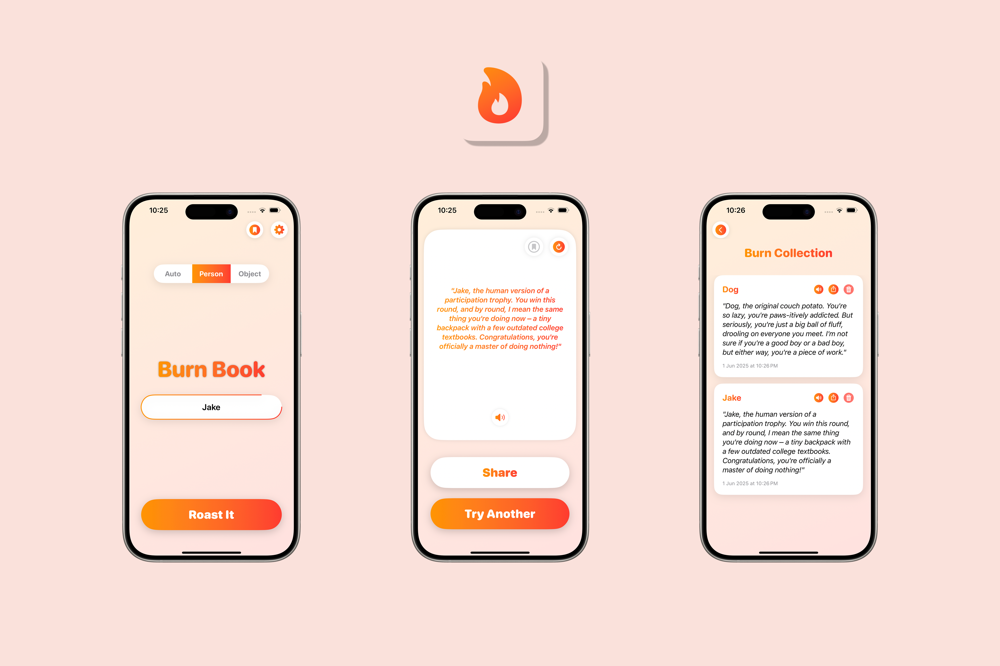

# 🔥 Meet BurnBook

Burn Book runs a light-weight large-language model (LLM) directly on your iPhone thanks to **[MLX-Swift](https://github.com/ml-explore/mlx-swift)**, so every roast is generated privately, instantly, and without racking up API fees.

## Features

- 🎯 **Target anything** - Auto-detect, or tell the model to roast a *Person* or an *Object*.
- 🗡️ **Roast Intensity** - From friendly banter to “Homicidal” or an overkill heat—slide to adjust the cruelty level.
- 🏛️ **Political toggle** - Keep politics out, or lean all the way in. Your call. 
- 🫧 **Profanity filter** - Ship-ready by default—switch it off if your audience can handle it. 
- 📴 **Offline, real-time** - The 4-bit quantized model lives on device, no network, no wait.
- 📤 **Share sheet** - Drop burns straight into Messages, TikTok captions, or wherever shade is needed.

## Under the hood

- **SwiftUI** - Pure declarative goodness.

- **Core Haptics** - Tactile feedback thrills every tap, slider move, and punchline.
 
- **LLM Runtime** - MLX‑Swift wrapping the Metal‑accelerated MLX tensor library.
 
- **Model** - Llama 3‑Instruct‑1B (~700 MB on disk), quantized to 4‑bit.

## Installation

1. Clone this repository: `git clone https://github.com/thisisayushs/BurnBook.git)`
2. Open the project in Xcode.
3. Run the app on a simulator or connected device.

*Coming soon to the App Store!*

## License

This project is licensed under the MIT License. See the [LICENSE](LICENSE) file for details.

